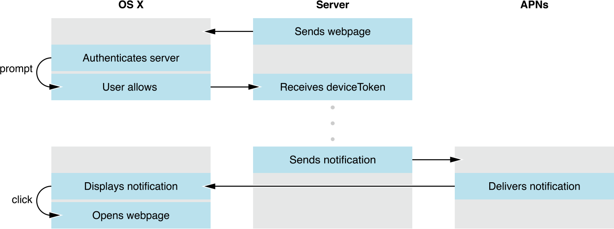

# safari-push-demo





## Dependencies:

主要依赖的两个module分别是：

apn（负责生成通知推送到Apple apns）

https://github.com/argon/node-apn


ssafari-push-notifications（负责生成 push package）

https://github.com/MySiteApp/node-safari-push-notifications


## Test:

https://safari-push-demo-app.herokuapp.com


## Install:

npm install


## Run

node bin/www

> 由于Apple规定，推送服务必须支持https才能让safari进行注册推送


## Option

push package目前生成的代码在app.js，在里面可以配置打包push package 的pem ，icon，domain等

```javascript
function createSignature() {
  var cert = fs.readFileSync('webPush/push_cert.pem'),
    key = fs.readFileSync('webPush/no_pass_private.pem'),
    websiteJson = pushLib.websiteJSON(
      "Safari Push Notification Test", // websiteName 
      "web.com.gf.testapp", // websitePushID 
      ["https://safari-push-demo-app.herokuapp.com"], // allowedDomains 
      "https://safari-push-demo-app.herokuapp.com/%@/?flight=%@", // urlFormatString， 
      0123456789012345, // authenticationToken (zeroFilled to fit 16 chars) 
      "https://safari-push-demo-app.herokuapp.com" // webServiceURL (Must be https!) 
    );

  pushLib.generatePackage(
      websiteJson, // The object from before / your own website.json object
      path.join('assets', 'safari_assets'), // Folder containing the iconset
      cert, // Certificate
      key // Private Key
    )
    .pipe(fs.createWriteStream('pushPackage.zip'))
    .on('finish', function() {
      console.log('pushPackage.zip is ready.');
    });
}	
```


## Usage


## API

url:**domain/**

Method：**GET**

Params：-

Description：**测试页面**

---

url：**domain/v1/pushPackages/[websitePushID]**

Method：**POST**

Params：

​	**websitePushID ： 由Apple developer center上申请**

Description：**safari将会在这里下载push package的有关内容**

---

url：**domain/v1/devices/[deviceToken]/registrations/[websitePushID]**

Method：POST

Params：

​	**deviceToken：每台电脑唯一的设备号**

​	**websitePushID：由Apple developer center上申请**

Description：**当safari发起window.safari.pushNotification.requestPermission时候，会调用当前API，同时server保存deviceToken用于之后推送消息使用**


---

url：**domain/v1/log**

Method：POST

Params：

​	**logs：错误日志**

Description：**如果在申请注册消息推送服务有任何错误，Safari会把错误内容通过当前接口上传**	


---

url：**domain/getTokens**

Method：**GET**

Params：-

Return：**tokens array**

Description：**获取已注册消息推送的token列表**

---

url：**domain/v1/devices/:deviceToken/registrations/:websitePushID**

Method：**DELETE**

Params：

​	**deviceToken：每台电脑唯一的设备号**

​	**websitePushID：由Apple developer center上申请**

Decription：**用户手动到safari — 偏好设置 — 通知 拒绝消息推送，那么safari会发送Delete请求删除已注册的token**

---

url：**domain/push**

Method：**POST**

Params：

```json
{
    "title":"Push title",	//标题
    "message":"Push Message",	//推送消息内容
    "action":"action",	//. The label of the action button, if the user sets the notifications to appear as alerts. This label should be succinct, such as “Details” or “Read more”. If omitted, the default value is “Show”.
    "token":"input token",	//已成功注册推送的token
    "arg1":"arg1",	//附加到url的参数
    "arg2":"arg2"	//附加到url的参数
}
```

Decription：**发送消息推送到对应的设备上**


## Reference

导出pem证书给服务端Push Notification使用     

http://blog.csdn.net/cooldragon/article/details/19404645


Configuring safari push notification      

https://developer.apple.com/library/prerelease/content/documentation/NetworkingInternet/Conceptual/NotificationProgrammingGuideForWebsites/PushNotifications/PushNotifications.html#//apple_ref/doc/uid/TP40013225-CH3-SW30